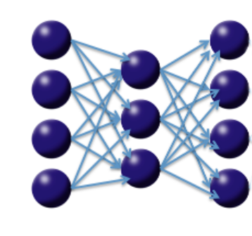

<br>

This tutorial shows how a Deep Learning Auto-Encoder model can be used to find outliers in a dataset.

Consider the following three-layer neural network with one hidden layer and the same number of input neurons (features) as output neurons. The loss function is the MSE between the input and the output. Hence, the network is forced to learn the identity via a nonlinear, reduced representation of the original data. Such an algorithm is called a deep autoencoder; these models have been used extensively for unsupervised, layer-wise pretraining of supervised deep learning tasks, but here we consider the autoencoder's application for discovering anomalies in data.

<center></center>

We use the well-known MNIST dataset of hand-written digits, where each row contains the 28^2=784 raw gray-scale pixel values from 0 to 255 of the digitized digits (0 to 9).

<br>

## Start H2O and load the MNIST data

```{r}
# Initialize and then connect to the H2O server
suppressPackageStartupMessages(library(h2o))
h2o.init(nthreads = -1)
h2o.no_progress()
```

```{r}
# Load MNIST (Kaggle Version)
# The data consists of 784 (=28^2) pixel values per row, with (gray-scale) values from 0 to 255. 
# The first column is the response (a label in 0,1,2,...,9).
mnist <- h2o.importFile(path = "kaggle_mnist_train.csv.gz")
```


```{r}
# We do unsupervised training, so we can drop the response column.
mnist <- mnist[, -1]
```

<br>

## Finding outliers - ugly hand-written digits

We train a Deep Learning Auto-Encoder to learn a compressed (low-dimensional) non-linear representation of the dataset, hence learning the intrinsic structure of the training dataset. The auto-encoder model is then used to transform all test set images to their reconstructed images, by passing through the lower-dimensional neural network. We then find outliers in a test dataset by comparing the reconstruction of each scanned digit with its original pixel values. The idea is that a high reconstruction error of a digit indicates that the test set point doesn't conform to the structure of the training data and can hence be called an outlier.

<br>

## Step 1 - Learn what's normal from the training data

Train unsupervised Deep Learning autoencoder model on the training dataset. For simplicity, we train a model with 1 hidden layer of 50 Tanh neurons to create 50 non-linear features with which to reconstruct the original dataset. We learned from the Dimensionality Reduction tutorial that 50 is a reasonable choice. For simplicity, we train the auto-encoder for only 1 epoch (one pass over the data). We explicitly include constant columns (all white background) for the visualization to be easier.

Note that the response column is ignored (it is only required because of a shared DeepLearning code framework).

```{r}
autoencoder_model <- h2o.deeplearning(x = 1:784,
                                      training_frame = mnist,
                                      hidden = c(50),
                                      epoch = 1,
                                      activation = "Tanh",
                                      autoencoder = TRUE,
                                      ignore_const_cols = FALSE)
```

<br>

## Step 2 - Find outliers in the data 

The Anomaly app computes the per-row reconstruction error for the MNIST data set. It passes MNIST data through the autoencoder model and computes mean square error (MSE) for each row.

```{r}
# Use h2o.anomaly(...) to calculate per-row reconstruction error
rec_error <- h2o.anomaly(object = autoencoder_model, data = mnist)
rec_error <- as.data.frame(rec_error)
```

<br>

## Step 3 - Visualize the good, the bad and the ugly 

We will need a helper function for plotting handwritten digits (adapted from http://www.r-bloggers.com/the-essence-of-a-handwritten-digit/).

```{r}
# Helper function
plotDigit <- function(mydata, rec_error) {
  len<-nrow(mydata)
  N<-ceiling(sqrt(len))
  op <- par(mfrow=c(N,N),pty='s',mar=c(1,1,1,1),xaxt='n',yaxt='n')
  for (i in 1:nrow(mydata)) {
    colors<-c('white','black')
    cus_col<-colorRampPalette(colors=colors)
    z<-array(mydata[i,],dim=c(28,28))
    z<-z[,28:1]
    image(1:28,1:28,z,main=paste0("rec_error: ", round(rec_error[i],4)),col=cus_col(256))
  }
  on.exit(par(op))
}

plotDigits <- function(data, rec_error, rows) {
 row_idx <- order(rec_error[,1],decreasing=F)[rows]
 my_rec_error <- rec_error[row_idx,]
 my_da <- as.matrix(as.data.frame(data))
     my_data <- my_da[row_idx,]
     plotDigit(my_data, my_rec_error)
}
```

Let's look at samples with low/median/high reconstruction errors. We will now visualize the original MNIST image and their reconstructions obtained by propagating them through the narrow neural net.

```{r}
recon <- h2o.predict(object = autoencoder_model, newdata = mnist)
```

<br>

## The Good 

Let's plot the 25 digits with lowest reconstruction error. First we plot the reconstruction, then the original scanned images.

```{r}
plotDigits(recon, rec_error, c(1:25))
plotDigits(mnist, rec_error, c(1:25))
```

Clearly, a well-written digit 1 appears in both the training and testing set, and is easy to reconstruct by the autoencoder with minimal reconstruction error. Nothing is as easy as a straight line.

<br>

## The Bad

Now let's look at the 25 digits with median reconstruction error.

```{r}
plotDigits(recon, rec_error, c(21001:21025))
plotDigits(mnist,   rec_error, c(21001:21025))
```

These test set digits look "normal" - it is plausible that they resemble digits from the training data to a large extent, but they do have some particularities that cause some reconstruction error.

<br>

## The Ugly

And here are the biggest outliers - The 25 digits with highest reconstruction error!

```{r}
plotDigits(recon, rec_error, c(41976:42000))
plotDigits(mnist,   rec_error, c(41976:42000))
```

Now here are some pretty ugly digits that are plausibly not commonly found in the training data - some are even hard to classify by humans.

<br>

## Conclusions

We were able to find outliers with H2O Deep Learning Auto-Encoder models. We would love to hear your usecase for Anomaly detection.

Note: Every run of DeepLearning results in different results since we use Hogwild! parallelization with intentional race conditions between threads. To get reproducible results at the expense of speed for small datasets, set `reproducible = TRUE` and specify a seed.


